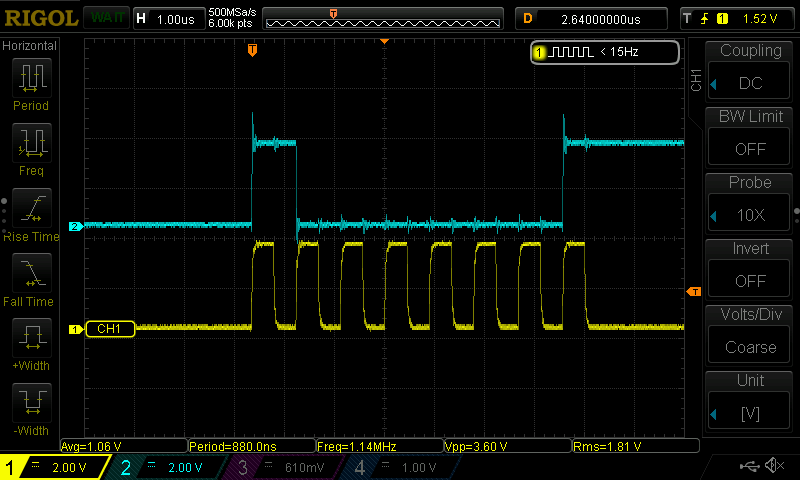
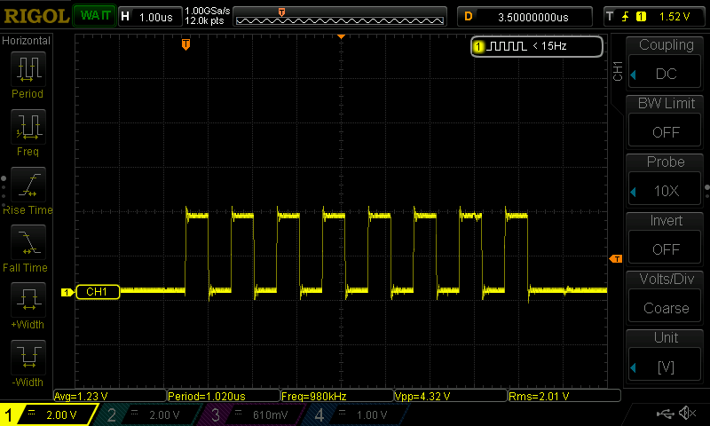

# FT232H on SPI32F103 BluePill board

This firmware is for the SPI32F103 BluePill board, acting like the FT232H
device. Not every feature is there, but it covers some crucial MPSSE commands
I really needed. At least on the USB level, the firmware mimics the FT232H,
and both the kernel ftdi_sio driver and userspace libftdi implementation
don't spot any differences.

Why? There are a couple of reasons driving me. The biggest one is the busted
SPI modes 1 and 3. It's a real pain when you spend hours trying to get something
to work, only to find out it's not supported ([here](https://forums.adafruit.com/viewtopic.php?t=124869), [here](https://electronics.stackexchange.com/questions/360086/make-ftdi-2232d-do-spi-mode-1-properly-data-seems-1-2-clock-cycle-off), [here](https://www.ftdicommunity.com/index.php?topic=692.0)).
The only place I found a mention of this was in [Application Note AN_114](https://ftdichip.com/Support/Documents/AppNotes/AN_114_FTDI_Hi_Speed_USB_To_SPI_Example.pdf), where
it casually drops: "FTDI device can only support mode 0 and mode 2 due to the
limitation of MPSSE engine." Yeah, limitations, sure thing.

When tinkering with the original FT232H, I stumbled upon another issue. It led
to a messy workaround of clearing the TX buffer on the device side before
sending an MPSSE write request that generates a read response (like an SPI
read triggered by the MPSSE_DO_READ (0x20) bit). Turns out, the FT232H USB
setup prepares a bulk read "IN" packet every time it receives a write "OUT"
bulk packet. You can easily find people griping about this by Googling
something like "FT_Read() returns 0 bytes". The workaround involves calling
`ftdi_usb_purge_tx_buffer()` just before the write request. Maybe I'm doing
something wrong, but the non-blocking behavior seems odd to me. Anyway, with
plenty of library implementations out there (C, Python, Go, etc.), why not
implement the necessary stuff in the STM32 firmware and run it smoothly on
the BluePill without these headaches?

### How to use

Build and flash BluePill board. For example for the open-source ST-Link
tools (e.g. stlink-tools package on Debian):

```
SERIAL=$(st-info --probe | grep serial | awk '{print $2}')
make SERIAL=$SERIAL flash-stlink
```

Once freshly flashed BluePill is connected to the host via USB, host
should detect the FT232H device. Done.

### Pin mappings

Firmware does the following mapping of the FT232H pins to STM32 pins:

ADBUS
```
FT232H    STM32
   AD0 -> PA5
   AD1 -> PA7
   AD2 -> PA6
   AD3 -> PA4
   AD4 -> PA3
   AD5 -> PA2
   AD6 -> PA1
   AD7 -> PA0
```

ACBUS
```
FT232H    STM32
   AC0 -> PB12
   AC1 -> PB13
   AC2 -> PB14
   AC3 -> PB15
   AC4 -> PA8
   AC5 -> PA9
   AC6 -> PA10
   AC7 -> PA11
```

### Supported commands

First of all see the list of supported commands in the real FT232H device
in the corresponding [spec](https://ftdichip.com/wp-content/uploads/2020/08/AN_108_Command_Processor_for_MPSSE_and_MCU_Host_Bus_Emulation_Modes.pdf).

#### USB control requests:

The following requests implemented as NOP stubs to shutup ftdi_sio kernel driver:

- **FTDI_SET_LATENCY_TIMER** - !!! TODO !!!, does nothing, returns success
- **FTDI_READ_EEPROM** - !!! TODO !!!, always returns 0xffff in IN bulk response
- **FTDI_SET_BITMODE** - !!! TODO !!!, currently only MPSSE mode is supported
- **FTDI_SET_BAUD_RATE** - !!! TODO !!!, does nothing, returns success
- **FTDI_SET_FLOW_CTRL** - !!! TODO !!!, does nothing, returns success

Implemented:

- **FTDI_RESET** - resets device to initial state

#### USB bulk OUT requests:

- **TCK_DIVISOR** - sets clock frequency, currenly only used for the CLK_BYTES command
- **SET_BITS_LOW** - configures 8 GPIO pins of the ADBUS
- **SET_BITS_HIGH** - configures 8 GPIO pins of the ACBUS
- **MPSSE_DO_WRITE** - clocks data bytes out. All modifiers flags are supported
- **MPSSE_DO_READ** - clocks data bytes in. All modifiers flags are supported
- **CLK_BYTES** - clocks n x 8 bits with no data transfer

### Examples

In the [examples/](./examples) folder a few Python examples can be found.

###### [examples/mpsse_spi.py](./examples/mpsse_spi.py)

Test "clocks data bytes in or out" or initiates SPI write-read request.
Before running the test, please don't forget to connect PA7 and PA6 pins
together to have a loopback receive.

The test does the following:

1. Sets bitmode to the MPSSE (the only mode supported by this firmware).
2. Sets SPI clock frequency to the 1Mhz (for the SPI 1.125Mhz is hardcoded)
3. Configures 3 GPIO pins of the ADBUS to output direction: SK (clock),
   CS (chip select), DO (device out). Set CS pin to high.
   On the STM32 these pins are mapped as the following:

```
     SK (AD0) -> PA5
     DO (AD1) -> PA7
     DI (AD2) -> PA6
     CS (AD3) -> PA4
```

4. Calls the `ftdi_usb_purge_tx_buffer()`, which is meaningfull only on the
   real FT232H device, for this firmware this call has no effect, since all
   the read calls are blocking.

5. Writes several requests in one bulk packet:

  - configures CS to low
  - initiates SPI write-read
  - configures CS to high

6. Reads SPI reply back. If device is configured for the loopback receive, i.e.
   PA7 and PA6 pins are connected together, then 0x81 byte should be read back.

The resulting osciloscope screenshot:



###### [examples/mpsse_clk_bytes.py](./examples/mpsse_clk_bytes.py)

Test "clocks n x 8 bits with no data transfer", or simply generates pulse
train on the SK (AD0) pin.

The test does the following:

1. Sets bitmode to the MPSSE (the only mode supported by this firmware).
2. Sets clock frequency to the 1Mhz
3. Configures 3 GPIO pins of the ADBUS to output direction: SK (clock),
   CS (chip select), DO (device out). Set CS pin to high.
   Mappings see in the previous example.

4. Writes several requests in one bulk packet:

  - configures CS to low
  - initiates 8 pulse train
  - configures CS to high

The resulting osciloscope screenshot:



### Specs

[Application Note AN_108](https://ftdichip.com/wp-content/uploads/2020/08/AN_108_Command_Processor_for_MPSSE_and_MCU_Host_Bus_Emulation_Modes.pdf)
